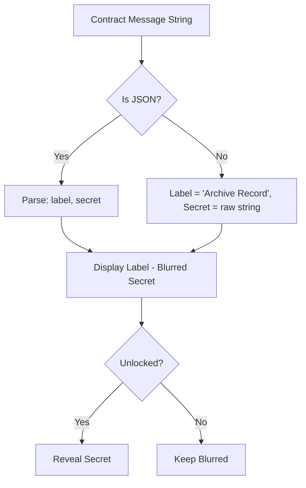

# BitCapsule Protocol Flowcharts

## 1. User Journey & Vault Lifecycle

```mermaid
graph TD
    A[User Connects Wallet] --> B{Network Correct?}
    B -- No --> C[Auto-Switch to MIDL Regtest]
    C --> D[Authenticated]
    B -- Yes --> D

    D --> E[Create Vault]
    E --> F[Input: Label, Amount, Unlock Time, Payload]
    F --> G[JSON Serialization: message = {label, secret}]
    G --> H[EVM Bridge & Call]
    H --> I[BTC Locked + EVM Intent Logged]

    I --> J[Vault Archive Sync]
    J --> K{Unlock Time Reached?}

    K -- No --> L[Panic Button - Force Crack]
    L --> M[20% Fee Applied]
    M --> N[Vault Terminated]

    K -- Yes --> O[Claim Protocol]
    O --> P[Full Amount Released]
    P --> N
```

## 2. Temporal Sync (Logic)


## 3. Metadata Processing


